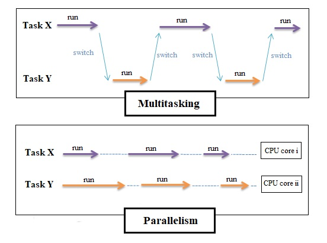
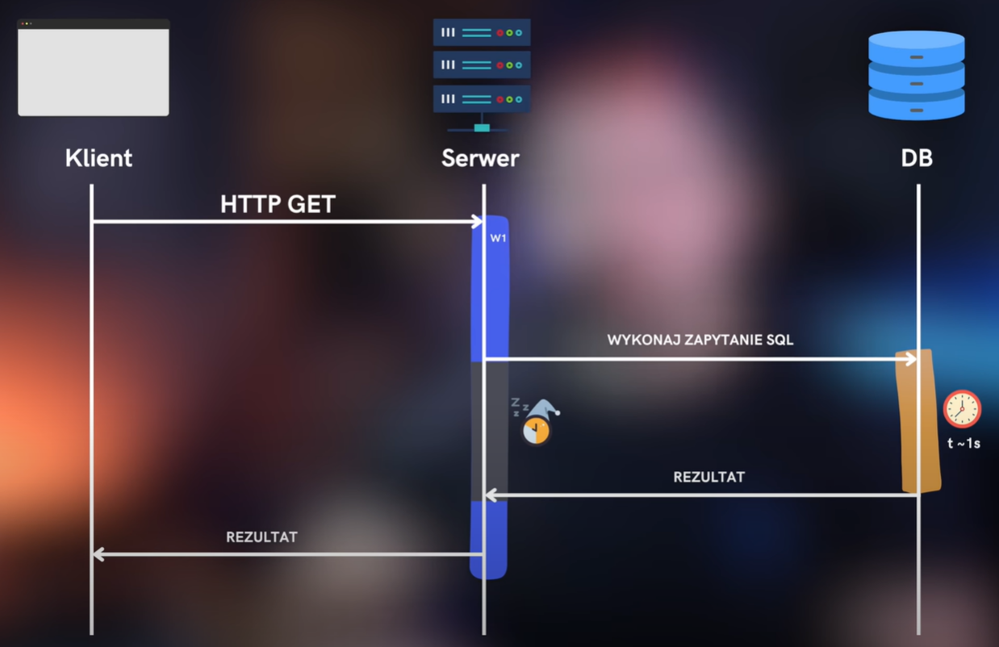
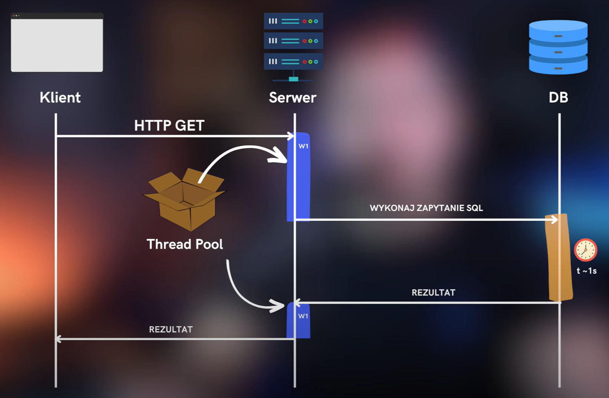

================================================================================================

# 2.4 - Introducing async and await

## Asynchronous programming

### Overview
- `async` & `await` keywords
- Suitable for I/O operations
- Asynchronous operations occurs in parallel, but it subscribes to when that operation completes
- `Task` represents asynchronous operation
- `await` waits for the operation to be completed, then continues execution. Pauses execution of the method until a result is available, without blocking the calling thread
- When debugging `await` call, while waiting for response control is returned to the calling thread (e.g. UI)

### Usage examples:
- network resources
- disk write & read
- memory
- database

## Parrarel Programming
- Task Parrarel Library (TPL)
- Suitable for CPU bound operations
- Split and solve small pieces independently, use as much computer resources as possible
- Allows for both asynchronous and parallel programming

# 2.5 - Understanding a continuation

- Asynchronous operations introduce separate threads where the work is being done
- `Task` represents asynchronous operation
- `await` keyword:
  - Retrieves result when available
  - Makes sure that there were no exceptions with awaited task
  - Introduces continuation that allows to get back to the original context (thread). 
    Code after `await` will run once task has completed and it will run on the same thread that spawned asynchronous operation
  - Re-throws exceptions that occured inside the `Task`, if task failed

  ```cs
  async void Search_Click(...)
  {
      var getStocksTask = GetStocks();
      await getStocksTask; // async/await all the way up
  
      // Everything after await is a continuation
  
      AfterLoadingStockData();
  }
  
  async Task GetStocks()
  {
      try
      {
          var store = new DataStore();
          Task responseTask = store.GetStockPrices();
          Stocks.ItemsSource = await responseTask; // Spawns async operation
      }
      // If responseTask throws an exception (on execution), then it will be re-throwed (await) and caught here
      catch (Exception ex)
      {
          Notes.Text = ex.Message;
      }
  }
  ```
  - Can be used only with method that returns `Task`
    
    ```cs
    async Task AsyncTaskMethod()
    {
        await TaskMethod();
    }

    Task TaskMethod() // no async
    {
        // ...
    }
    ```

# 2.6 - Creating own async method

- `async` keyword allows for using `await` keyword
- `async void` should be used only for event handlers
- `Task` represents an asynchoronous operation
- `async Task` method automatically returns `Task`, without explicit `return`. Compiler does it for us.
  
  ```cs
  public class Class 
  {
      public async Task Method() { }
  }
  ```

  is compiled to:

  ```cs
  // Other generated code...

  public Task Method()
  {
      <Method>d__0 stateMachine = new <Method>d__0();
      stateMachine.<>t__builder = AsyncTaskMethodBuilder.Create();
      stateMachine.<>4__this = this;
      stateMachine.<>1__state = -1;
      stateMachine.<>t__builder.Start(ref stateMachine);
      return stateMachine.<>t__builder.Task;
  }
  ```

- `Task` object returned from an asynchronous method is a reference to operation/result/error
  
```cs
var getStocksTask = GetStocks(); // Create separate thread, with the code to execute
await getStocksTask; // Execute this code
```

# 2.7 - Handling exceptions

## Missing await

- Re-throwing exceptions sets the `Task` to faulted with an exception
- Without `await`, exception isn't re-throwed
  
  ```cs
  async void Search_Click(...)
  {
      try
      {
          /*await*/ GetStocks();
  
          // Execution isn't awaited, so it continues before the call is completed
          // and we have no idea what happened to this task
      }
      catch (Exception ex) // No await = no catch
      {
          Notes.Text = ex.Message;
      }
  }
  
  async Task GetStocks()
  {
      throw new Exception("I love exception mechanism <3");
      // Task status is set to Faulted
  }
  ```

## async void

- If `async` method returns a `Task` then we can use all the additional info, e.g. exceptions
  (`Task` is automatically returned, when method signature indicates it).
  But when it returns `void` there is no additional info (and call can't be awaited)
- It may crash the application when there is an unhandled exception. 
  Exceptions occuring in `async void` can't be caught

  ```cs
  void Search_Click(...)
  {
      try
      {
          GetStocks();
      }
      catch (Exception ex)
      {
          Notes.Text = ex.Message;
      }
  }  

  async void GetStocks() // async void method
  {
      try
      {
          // ...
          Stocks.ItemsSource = await responseTask; // Exception thrown here
      }
      catch (Exception ex) // Demo try catch, it's useless (lost stack trace)
      {
          // The return type is void, not a Task, exception can't be set on a void,
          // so it's thrown back to the caller and app crashes.
          // Returning an exception in Task would be correct (compiler does it automatically).
          throw ex;
      }
  }
  ```
  
  - When working with `async void` whole code in method should be in `try`, `catch`, `finally` blocks,
    without `throw`, so it makes sure no exception is thrown back to the caller (prevents app crash)

# 2.8 - Best practices

- Asynchronous ASP.NET relieves web server of work and it can take care of other requests while asynchronous
  operations are running
- `.Result` or `Wait` on `Task` variable will block thread, execution will run synchronously,
  it may even deadlock whole application
- Using `.Result` in the continuation is fine

  ```cs
  async void GetStocks()
  {
      var store = new DataStore();
      var responseTask = store.GetStockPrices("MSFT");
      await responseTask;

      Stocks.ItemsSource = responseTask.Result; // it was awaited, so Result is fine here
  }
  ```

# 3.1 - TPL

## Task class

- `Task` allows:
  - to execute work on a different thread
  - to get the result from asynchronous operation
  - to subscribe to when operation is done + continuation
  - for exception handling

## Task.Run static method

`Task.Run` queues methods on the thread pool for execution.

```cs
Task task1 = Task.Run(() => { /* Heavy operation */ });

// Generic version with return value
Task task2 = Task.Run<T>(() => { return new T(); });
```

# 3.1 - Task intro

```cs
// Offloading work on another thread.
// It queues this anonymous method execution on the thread pool
// and it shoud be executed immediately (assuming that thread pool isn't busy).
var data = await Task.Run(() =>
{
    // Assuming that ReadAllLinesAsync version isn't available
    var lines = File.ReadAllLines("file.csv");
    var data = new List<StockPrice>();
    
    foreach (var line in lines)
    {
        var price = StockPrice.FromCSV(line);
        data.Add(price);
    }
    
    return data;
});

Stocks.ItemsSource = data.Where(sp => sp.Identifier == StockIdentifier.Text);
```

# 3.2 - Creating async operation with TPL Task

- When not awaiting `Task.Run`, the task scheduler will queue this to the thread pool
  and it will execute that whenever there is an available thread.
  This call will complete immediately and code execution will continue (no await)

```cs
Task.Run(() => {});
```

# 3.3 - Obtaining the async result without async await keywords

- `ContinueWith` is an alternative approach to subscribe to an async operation

```cs
void Search_Click(...)
{
    try
    {
        var loadLinesTask = Task.Run(() => File.ReadAllLines("StockPrices_Small.csv"));

        // ContinueWith allows for continuation and it will run when task has finished
        var processStocksTask = loadLinesTask.ContinueWith(completedTask =>
        {
            // In contrast to await continuation, it won't execute on the original thread.
            
            // Task has completed, so using Result is ok here,
            // it won't lock any thread, it just contains what the task returns
            var lines = completedTask.Result;
        });
    }
    catch (Exception ex)
    {
        Notes.Text = ex.Message;
    }
}
```
- `async` & `await` is easier to read, has less code and is less error prone

# 3.4 - Nested asynchronous operations

```cs
async Task NestedAsync()
{
    // Thread 1
    Task.Run(async () => // anonymous async method automatically returns a `Task`, not `async void`
    {
        // Thread 2
        await Task.Run(() =>
        {
            // Thread 3
        });
        // Thread 2 (continuation)
    });
    // Thread 1
}
```

# 3.5 - Handling Task success and failure

- No matter how async operation is executed, it should always be validated (exception handling).
  To validate task execution either use:
  - `async`, `await` and `try`, `catch`
    
  ```cs
  try
  {
    // ...
      await task;
  }
  catch (Exception e)
  {
      // Log e.Message
  }
  ```
  - `ContinueWith` with error handling options
    
  ```cs
  await task.ContinueWith(t =>
  {
      // Log t.Exception.Message (aggregate exception)
  }, TaskContinuationOptions.OnlyOnFaulted);
  ```

- Working with `ContinueWith`:
  
```cs
var loadLinesTask = Task.Run(() => throw new FileNotFoundException());

loadLinesTask.ContinueWith(completedTask => { /* Will always run */ });

loadLinesTask.ContinueWith(completedTask =>
{
    // Will run if successfully completed
}, TaskContinuationOptions.OnlyOnRanToCompletion);
```
# 3.6 - Canceling a Task with CancellationTokenSource

```cs
CancellationTokenSource cts = new();
CancellationToken ct = cts.Token;

// CancellationToken can be passed to async methods
```

- `CancellationTokenSource`:
  - Provides cancellation request mechanism using cancellation tokens
  - Signals to a `CancellationToken` that it should be canceled with `Cancel`/`CancelAfter` methods
  - Calling `CancellationTokenSource.Cancel` won't automatically cancel asynchronous operations,
    `CancellationToken` and its members are used for that purpose
  - It is created at the source of an operation/s that may need to be cancelled
  
- `CancellationToken`:
  - Obtained as a property from `CancellationTokenSource`
  - Indicates to a task that it's canceled, represents cancellation itself,
    which can be checked or received to handle cancellation request.
    Doesn't have the capability to trigger cancellation, it can be only observed
  - It's passed to various methods that support cancellation, to observe and react to cancellation request

- Passing `CancellationToken` to `Task.Run` won't stop execution "inside",
  it just won't start `Task.Run` if `CancellationToken` is marked as cancelled
  
```cs
cts.Cancel();
var task = Task.Run(() => { }, ct); // won't start, doens't affect anonymous method
task.ContinueWith(t => { }, ct); // same logic applies here
```

- `TaskStatus` has different values depending on how we chain continuation methods:

```cs
var ct = new CancellationToken(canceled: true);
var task = Task.Run(() => "I won't even start", ct);

task.ContinueWith(t => {
    // t.Status = TaskStatus.Canceled
});

task.ContinueWith(t => {
    // t.Status = TaskStatus.Canceled
});
```
but chaining next `Task` with `ContinueWith` is different:

```cs
var ct = new CancellationToken(canceled: true);
var task = Task.Run(() => "I won't even start", ct);

task.ContinueWith(t => {
    // t.Status = TaskStatus.Canceled
})
.ContinueWith(t => {
    // t.Status = TaskStatus.RanToCompletion
});
```

- To cancel own long running task we can use `CancellationToken.IsCancellationRequested`:
  
```cs
Task.Run(() =>
{
    while (true)
    {
        if (ct.IsCancellationRequested)
            break;
    }
});
```
- Execution of operation can be registered on operation cancellation
  
```cs
cts.Token.Register(() => Notes.Text = "Cancellation requested");
```

# 3.7 - HTTP Client cancellation

- Canceling defined asynchronous methods might be different.
  Sometimes it might return partial data and sometimes it throws `TaskCanceledException` to let know that it was canceled

```cs
using var httpClient = new HttpClient();
var result = await httpClient.GetAsync(url, ct);
```

# 3.8 - Summary

- If two methods are needed, sync and async version, don't wrap sync version with `Task.Run` just to make it async.
  It should be copied and refactored, implemented properly.

# 4.2 - Knowing When All or Any Task Completes

```cs
foreach (string identifier in identifiers)
{
    // Each call wii be awaited one by one (await)
    var loadTask = await service.GetStockPricesFor(identifier, cancellationTokenSource.Token);
}
```

- Data can be loaded in parallel by performing multiple asynchronous operations at the same time
- `Task.WhenAll` accepts a task collection, it creates and returns a `Task`.
  Returned task status is completed only when all the tasks passed to the method are marked as completed.

  ```cs
  var loadingTasks = new List<Task<IEnumerable<int>>>();

  foreach (string id in ids)
  {
      var loadTask = service.GetAsync(id, cts.Token);
      loadingTasks.Add(loadTask);
  }
  
  var allResults = await Task.WhenAll(loadingTasks);
  ```

- With no `await` it isn't executed, it's a representation of loading all the stocks

  ```cs
  var allResults = Task.WhenAll(loadingTasks);
  ```
- `Task.WhenAny` returns `Task` after the completion of any first task.
  It can be used to create a timeout:

```cs
// ...

var timeoutTask = Task.Delay(2000); // timeout after 2s
var loadAllStocksAtOnceTask = Task.WhenAll(loadingTasks);

var firstCompletedTask = await Task.WhenAny(loadAllStocksAtOnceTask, timeoutTask);

if (firstCompletedTask == timeoutTask)
    throw new OperationCanceledException("Loading timeout");

return loadAllStocksAtOnceTask.Result;
```

but it's easier to use `cancellationTokenSource.CancelAfter` method to achieve a timeout

- When `Task.WhenAll/WhenAny` are awaited it ensures that if any task failed within method, the exception will be propagated back to the calling context

# 4.3 - Precomputed Results of a Task

- Precomputed results of a `Task` are used to return results from methods where we don't want to use `async` & `await`, or `Task.Run`, so we don't run a new task.
- Adding `async` & `await` when they're not needed introduces a whole unnecessary async state machine and is just more complex
- When implementing interface / overriding a method that forces to return a `Task`, but the implementation doesn't have any asynchronous operation, a `Task.CompletedTask` can be returned instead

```cs
public Task Method() // no async
{
    return Task.CompletedTask;
    // Everything completed successfuly, with no method signature change
}

// Async implementation would be awaited
await Method(); // completes immediately
```

- Methods `Task.FromResult`, `Task.FromCanceled`, `Task.FromException` can be used like `Task.CompletedTask`, but with a return value. 
- `Task.FromResult` creates a `Task` which is marked as completed with the specified result, so it's just a `Task` result wrapper

# 4.4. Process Tasks as They Complete

- Standard .NET collections aren't thread-safe.
  Thread-safe collections should be used when working with collections on multiple threads
- Data can be processed on the fly as subsequent tasks are completed

```cs
var loadingTasks = new List<Task>();
var stocks = new ConcurrentBag<StockPrice>();

foreach (string id in ids)
{
    var loadTask = service.GetStockPricesFor(id, cts.Token)
        .ContinueWith(completedTask =>
        {
            foreach (var stock in completedTask.Result)
                stocks.Add(stock);
            
            UpdateStocksUi(stocks);
        }, 
        TaskContinuationOptions.OnlyOnRanToCompletion);

    loadingTasks.Add(loadTask);
}

await Task.WhenAll(loadingTasks);
```

# 4.5. Execution Context and Controlling the Continuation

- For reasons like performance or context switching, there isn't always a need to return to the original context,
  when running the code in the continuations
- `Task.ConfigureAwait`:
  - Configures method how the continuation should execute.
  - It can be configured with `ConfigureAwait(false)` to continue on the new thread.
    Each method marked with `async` has its own asynchronous context, therefore
    it only affects the continuation in the method that you are operating in.
  - No code after `ConfigureAwait(false)` should require the original context.
  - `ConfigureAwait(false)` means, that there is no continuation enqueue on a thread pool.
    It's quicker than waiting for another thread to be available.

```cs
private async Task Method1()
{
    // Thread 1
    await Method2();
    // Thread 1 (marshaled back)
}

private async Task Method2()
{
    // Thread 1
    await Task.Run(() => { })
        .ConfigureAwait(false);
    // Thread 2
    // Continue on new thread
}
```

# 4.6. ConfigureAwait in ASP.NET

- ASP.NET Core doesn't use synchronization context, thus making `ConfigureAwait(false)` is useless
- `ConfigureAwait(false)` should be used in libraries, because the library can be used by any type of application

# 5.2. Asynchronous Streams and Disposables

- `IAsyncEnumerable<T>`:
  - Allows for asynchronous retrieval of each item as it arrives to the application
  - Exposes an enumerator that provides asynchronous iteration
  - No need to return a `Task` if method is `async`
  - Method must `yield return`
  - Using `yield return` with `IAsyncEnumerable<T>` signals to the iterator using this enumerator that it has an item to process
  - `async IAsyncEnumerable<T>` metho can't be awaited, because it's an enumeration
  - `await foreach`: 
    - Is used to asynchronously retrieve the data
    - It awaits each item in the enumeration
    - `foreach` body is a continuation of each enumeration

```cs
// Producing a stream
public async IAsyncEnumerable<StockPrice> GetStocks(CancellationToken ct = default)
{
    await Task.Delay(50, ct); // fake delay
    yield return new StockPrice() { Identifier = "TEST" };
}

// Consuming a stream
var enumerator = service.GetStocks();
await foreach (var stock in enumerator) { }
```

- `EnumeratorCancellationAttribute` is used with `IAsyncEnumerable<T>.WithCancellation`

```cs
public async IAsyncEnumerable<Stock> GetStocks([EnumeratorCancellation] CancellationToken ct = default) { }

//...

var enumerator = service.GetStocks();
await foreach (var stock in enumerator.WithCancellation(cts.Token)) {}
```

- Resources can be cleaned up asynchronously bo implementing `IAsyncDisposable` and `await using`

```cs
public class StockStreamService : IAsyncDisposable
{
    // ...

    public async ValueTask DisposeAsync()
    {
        // ... 
    }
}

await using var service = new StockStreamService();
```

# 5.3. The Implications of Async and Await

- Using `async` keyword generates a bit of code and introduces a state machine
- State machine is generated for every `async` method
- State machine allows for:
  - Keeping track of tasks
  - Executes the continuation
  - Provides potential result
  - Handles context switching - ensures that the contination executes on the correct context
  - Handles exceptions

- Not `async` method:

```cs
private void Method() => Console.WriteLine("Sample text"); 
```

is compiled into:

```cs
private void Method()
{
    Console.WriteLine("Sample text");
}
```

No changes there, but method with `async` 

```cs
private async void Method() => Console.WriteLine("Sample text"); 
```

is compiled into:

```cs
[AsyncStateMachine((Type) typeof(<Method>d__5)), DebuggerStepThrough]
private void Method()
{
    <Method>d__5 stateMachine = new <Method>d__5 
    {
        <>t__builder = AsyncVoidMethodBuilder.Create(),
        <>4__this = this,
        <>1__state = -1
    };
    stateMachine.<>t__builder.Start<<Method>d__5>(ref stateMachine);
}

// This is a concrete implementation that is responsible for running the code (used above)
[CompilerGenerated]
private sealed class <Method>d__5 : IAsyncStateMachine
{
    // Fields
    public int <>1__state;
    public AsyncVoidMethodBuilder <>t__builder;
    public MainWindow <>4__this;

    // Methods
    private void MoveNext()
    {
        int num = this.<>1__state;
        try
        {
            Console.WriteLine("Sample text"); // here is the code defined in Method
        }
        catch (Exception exception)
        {
            this.<>1__state = -2;
            // AsyncVoidMethodBuilder btw tries to set the exception, but there is no Task to set it on
            this.<>t__builder.SetException(exception);
            return;
        }
        this.<>1__state = -2;
        this.<>t__builder.SetResult();
    }

    [DebuggerHidden]
    private void SetStateMachine([Nullable(1)] IAsyncStateMachine stateMachine)
    {
    }
}
```

This whole code is executed on the caller thread. Nothing has been offloaded to a different thread yet.

- `async Task` method uses different builder and returns a `Task` object:

```cs
private async Task Foo()
{
    string result = await Task.Run(() => "Hello");
    Console.WriteLine("World");
}
```

is compiled into:

```cs
[NullableContext(1), AsyncStateMachine((Type) typeof(<Foo>d__6)), DebuggerStepThrough]
private Task Foo()
{
    <Foo>d__6 stateMachine = new <Foo>d__6 
    {
        <>t__builder = AsyncTaskMethodBuilder.Create(),
        <>4__this = this,
        <>1__state = -1
    };
    stateMachine.<>t__builder.Start<<Foo>d__6>(ref stateMachine);
    return stateMachine.<>t__builder.get_Task();
}

[CompilerGenerated]
private sealed class <Foo>d__6 : IAsyncStateMachine
{
    // Fields
    public int <>1__state;
    public AsyncTaskMethodBuilder <>t__builder;
    public MainWindow <>4__this;
    private string <result>5__1;
    private string <>s__2;
    private TaskAwaiter<string> <>u__1;

    // Methods
    private void MoveNext()
    {
        int num = this.<>1__state;
        try
        {
            TaskAwaiter<string> awaiter;
            if (num == 0)
            {
                awaiter = this.<>u__1;
                this.<>u__1 = new TaskAwaiter<string>();
                this.<>1__state = num = -1;
                goto TR_0004;
            }
            else
            {
                awaiter = Task.Run<string>(MainWindow.<>c.<>9__6_0 ??= new Func<string>(this.<Foo>b__6_0)).GetAwaiter();
                if (awaiter.IsCompleted)
                {
                    goto TR_0004;
                }
                else
                {
                    this.<>1__state = num = 0;
                    this.<>u__1 = awaiter;
                    MainWindow.<Foo>d__6 stateMachine = this;
                    this.<>t__builder.AwaitUnsafeOnCompleted<TaskAwaiter<string>, MainWindow.<Foo>d__6>(ref awaiter, ref stateMachine);
                }
            }
            return;
        TR_0004:
            this.<>s__2 = awaiter.GetResult();
            this.<result>5__1 = this.<>s__2;
            this.<>s__2 = null;
            Console.WriteLine("World"); // continuation
            this.<>1__state = -2;
            this.<result>5__1 = null;
            this.<>t__builder.SetResult();
        }
        catch (Exception exception)
        {
            this.<>1__state = -2;
            this.<result>5__1 = null;
            this.<>t__builder.SetException(exception);
        }
    }

    [DebuggerHidden]
    private void SetStateMachine([Nullable(1)] IAsyncStateMachine stateMachine)
    {
    }
}
```

Now state machine keeps track of the current state and has an awaiter to keep track of current ongoing operations,
to know if it's completed

# 5.4. Reducing the Amount of State Machines

All the methods using `await` and `async` keywords validate that the method it's calling completed successfully.
Methods below are waiting for a result, and this means that each of them will have a generated state machine code.

```cs
private async Task<string> Method1()
{
    return await Method2();
}

private async Task<string> Method2()
{
    return await Method3();
}

private async Task<string> Method3()
{
    return await Task.Run(() => "Hello");
}
```

There is no continuation in these methods, so to keep amount of generated code to a minimum, we can skip `async` & `await`. 
If the caller has the opportunity to await `Task`, then is should do so. Asynchronous operation should be awaited at the top level. It also reduces potential errors.

```cs
private async Task<string> Method1()
{
    return await Method2();
}

private Task<string> Method2()
{
    return Method3();
}

private Task<string> Method3()
{
    return Task.Run(() => "Hello");
}
```

# 5.5 - Deadlocking

A deadlock occurs if 2 threads depend on each other and one of them is blocked.
`Task` has a method `Wait` which will block the current thread until the data for the task is available.

```cs
private void Search_Click(...)
{
    var task = Task.Run(() =>
    {
        // Update UI (communicate with the original thread)
        Dispatcher.Invoke(() => { });
    });
    
    // Wait = block UI thread until all processing has completed,
    // but it can't completed, bacause it can't communicate back
    task.Wait();
}
```
UI thread waits for a thread to complete and this thread cannot complete unless it can communicate back to the UI thread.

Another deadlock with `Wait`:

```cs
private void Search_Click(...)
{
    LoadStocks().Wait(); // Deadlock, no await
}

private async Task LoadStocks()
{
    // Load data...
    Stocks.ItemsSource = data.SelectMany(x => x);
}
```

Deadlock with `Result`:

```cs
private void Search_Click(...)
{
    Stocks.ItemsSource = LoadStocks().Result; // Deadlock, no await
}

private async Task<IEnumerable<StockPrice>> LoadStocks()
{
    // Load data...
    return data.SelectMany(x => x);
}
```

The state machine with the code inside runs on the same thread (UI in this case) and it can't be executed, because this thread is blocked.
Asynchronous operation can't communicate to the state machine when it completes.

# 6.2. Report on the Progress of a Task

`Progress<T>` provides `IProgress<T>` that invokes callbacks for each reported value with `IProgress<T>.Report`.
`Progress<T>.ProgressChanged` event is raised every report on the calling context.
Passing `Progress<T>` object to another thread will use synchronization context, like awaiter when communicating back to the original context.

# 6.3. Using Task Completion Source

In C#, there are several options for performing parallel operations. The latest one is the TPL approach.

## Event-based asynchronous pattern

We can subscribe to events that indicate when the operations are completed.

```cs
var worker = new BackgroundWorker();

worker.DoWork += (sender, e) =>
{
    // Runs on a different thread
    Dispatcher.Invoke(() => Notes.Text += $"Worker DoWork\n");
};

worker.RunWorkerCompleted += (sender, e) =>
{
    // Triggered when work is done  
    Notes.Text += $"Worker completed";
};

worker.RunWorkerAsync();
```

## Manual ThreadPool enqueue 

It can't be awaited.

```cs
ThreadPool.QueueUserWorkItem(_ =>
{
    // Run on a different thread
    Dispatcher.Invoke(() => Notes.Text += $"ThreadPool work item");
});
```

## TaskCompletionSource

- Used for old, legacy code to create awaitable `Task`
- `TaskCompletionSource<T>` is for consuming a parallel or async operations different than TPL approach,
  where `Task` isn't exposed, so no `async` & `await` keywords can be used
- Creates a `Task` which could be reutrned or awaited
- `TaskCompletionSource<T>.Task` doens't run anything itself,
  it is marked as completed when it gets the result set on it, so it means it can be awaited

# 6.4. Working with Attached and Detached Tasks

```cs
Task.Run(() => // parent task
{
    Task.Run(() => { }); // child task
    Task.Run(() => { }); // child task
});
```

- `Task.Run` doesn't have `TaskContinuationOptions`, it's a shortcut of using the `Task.Factory`

```cs
Console.WriteLine("Starting");

await Task.Factory.StartNew(() =>
    {
        Task.Factory.StartNew(() =>
        {
            Thread.Sleep(1000);
            Console.WriteLine("Completed 1");
        });
        Task.Factory.StartNew(() =>
        {
            Thread.Sleep(2000);
            Console.WriteLine("Completed 2");
        });
        
        // Parent tasks immediately starts child tasks and it's marked as completed
    });

Console.WriteLine("Completed");
```

Result:
```
Starting
Completed
Completed 1
Completed 2
```

Using `TaskCreationOptions.AttachedToParent`

```cs
Console.WriteLine("Starting");

await Task.Factory.StartNew(() =>
    {
        Task.Factory.StartNew(() =>
        {
            Thread.Sleep(1000);
            Console.WriteLine("Completed 1");
        }, TaskCreationOptions.AttachedToParent); // Attach to parent
        
        Task.Factory.StartNew(() =>
        {
            Thread.Sleep(2000);
            Console.WriteLine("Completed 2");
        });
    });

Console.WriteLine("Completed");
```

Result:
```
Starting
Completed 1
Completed
Completed 2
```

Using `TaskCreationOptions.DenyChildAttach`, which is default for `Task.Run`.
All child tasks would work as detached tasks.

```cs
Console.WriteLine("Starting");

await Task.Factory.StartNew(() =>
    {
        Task.Factory.StartNew(() =>
        {
            Thread.Sleep(1000);
            Console.WriteLine("Completed 1");
        }, TaskCreationOptions.AttachedToParent);
        
        Task.Factory.StartNew(() =>
        {
            Thread.Sleep(2000);
            Console.WriteLine("Completed 2");
        });
    }, TaskCreationOptions.DenyChildAttach);

Console.WriteLine("Completed");
Console.ReadKey();
```

Result looks like default `Task.Factory.StartNew` call with no options:
```
Starting
Completed
Completed 1
Completed 2
```

================================================================================================

# Asynchronous, parallel, concurrent programming

## Concurrent & parallel

Multitasking, solving problems "at the same time".

### Concurrent

Concurrent programming made it possible to solve the problem of multitasking when the first OS were created, even with only 1 CPU core.
During concurrent programming, there is a context switching, that is imperceptible to humans (looks like parallelism).

### Parallel

CPU cores can perform operations independently, so with their use we can program in parallel.
Used in the CPU bound scenarios to maximize performance.



Both approaches can be used at the same time.

## Asynchronous

Used for I/O operations that are beyond the scope of the application and require processing time in an external program.
After calling an I/O operation, we can wait for the result
- blocking the resources until the result is returned
- asynchronously, which doesn't block the resources.

# C# asynchronous patterns history

APM - Asynchronous Programming Model
EAP - Event-based Asynchronous Pattern
TAP - Task-based Asynchronous Programming

# Synchronous (blocking) web server example

Synchronous web application with 1 CPU core during the request execution starts a new thread, if it performs synchronous operation, it will block the application.
If application used by more than 1 user, concurrent programming with context switching is used to handle such requests (1 CPU core).
Web server has a thread pool with limited number of threads (that handle requests). By default it's `(CPU physical core number) x (number of threads that can be run on each core)`, so if the CPU has 6 cores and 2 threads on each, there will be 12 threads in the thread pool to use. When the number of available threads is exceeded, a thread throttling mechanism is used.
The synchronous approach makes the thread in such an approach wait most of the time for the result and during this time it could perform other operations.

```cs
app.MapGet("/sync", () =>
{
    Thread.Sleep(1000); // It waits most of the time, blocking the thread
    return "Hello";
});
```

Result is returned after 1s and thread handling that request is blocked.

Load test results:

```
API sync load test scenario (5s timeout)
    - requests: 188
    - ok:       76      (p50 = 3022.85 ms, p75 = 3039.23 ms, p95 = 3993.6 ms, p99 = 4583.42 ms)
    - fail:     112     (min > 5s)
```



# Asynchronous web server example

Asynchronous programming can be impltemented on 1 thread, but doesn't require more than 1 core or 1 thread.

In the asynchronous version as in the synchronous version - one thread is taken from the thread pool to handle the request, but instead of blocking the thread, while waiting for the result, it is returned to the thread pool and it can be resued by another request. Adter receiving the result continuation doens't have to take place on the same thread on which it was started, Thread Pool can allocate another thread. Storing context execution is needed to continue code execution properly.

`Task` is a representation of asynchronous operation that can return a result
`await` returns the control to caller (non-blocking)

```cs
app.MapGet("/async", async () =>
{
    // Doesn't block the thread, it's returned to the Thread Pool while waiting for the result
    await Task.Delay(1000);
    return "Hello";
});
```

Result is still returned after 1s, but it doesn't block the thread, so thread can be reused in another request. This means that more requests can be handled this way. 

Load test results:

```
API async load test scenario (5s timeout)
    - requests: 109497
    - ok:       109430  (p50 = 1218.56 ms, p75 = 1296.38 ms, p95 = 1704.96 ms, p99 = 1797.12 ms)
    - fail:     67      (min > 5s)
```



# Awaiting results

Debugging doesn't stop asynchronous operations.

The `await` keyword guarantees that the code after it won't be executed until the asynchronous operation is completed.

================================================================================================

# Questions / TODO

1. What is the difference?
   
```cs
Task.Run(() => GetStocks());
Task.Run(async () => await GetStocks());

async Task GetStocks() { /* ... */ }
```

1. When `Task.Run` is executed? What is the difference?

```cs
var loadLinesTask = SearchForStocks();

Task<List<string>> SearchForStocks()
{
    return Task.Run(async () =>
    {
        // ...
        return lines;
    });
}
```

```cs
var loadLinesTask = awaitSearchForStocks();

async Task<List<string>> SearchForStocks()
{
    return await Task.Run(async () =>
    {
        // ...
        return lines;
    });
}
```

1. What is the point of that?
   
```cs
async Task AsyncTaskMethod()
{
    await TaskMethod();
}

Task TaskMethod() // no async
{
    // ...
}
```

1. Can I spawn too many threads and overflow a thread pool?

1. When is the method executed? What if an exception is thrown?

```cs
void Search_Click(...)
{
    try
    {
        var loadLinesTask = Task.Run(() => File.ReadAllLines("StockPrices_Small.csv"));
        var processStocksTask = loadLinesTask.ContinueWith(completedTask => { /* continuation */ });
    }
    catch (Exception ex)
    {
        Notes.Text = ex.Message;
    }
}
```

1. Try different `ContinueWith` chain executions, `OnlyOnFaulted` etc.

1. Multiple awaits and exception.
   If `responseTask` throws an exception (on execution), then it will be re-throwed (await) and caught, but what about `getStocksTask`?

  ```cs
  async void Search_Click(...)
  {
      var getStocksTask = GetStocks();
      await getStocksTask;
      AfterLoadingStockData();
  }
  
  async Task GetStocks()
  {
      try
      {
          var store = new DataStore();
          Task responseTask = store.GetStockPrices();
          Stocks.ItemsSource = await responseTask;
      }
      catch (Exception ex)
      {
          Notes.Text = ex.Message;
      }
  }
  ```

1. Check `CancellationTokenSource.Dispose`

1. Standard .NET collections aren't thread-safe, try to break few and check what happens

1. What happens if `Task.WhenAny` returns the first completed task and the next task throws an exception?

1. Explore the benefits of `ConfigureAwait(false)`

1. Is async method with no await started like Task.Run?

```cs
using var cts = new CancellationTokenSource();

// Is thread pool involved here? How does it wokrk? Is it a different thread?
var backgroundTask = StartBackgroundService(cts.Token);

// ...

cts.Cancel();

// And what is the task status before and after this?
// App can't close propetly without this, why is that?
await backgroundTask;

async Task StartBackgroundService(CancellationToken ct)
{
    try
    {
        while (!ct.IsCancellationRequested) { /* ... */ }
    }
    catch (TaskCanceledException) { }
}
```

1. Are all continuations running on the same new thread?

```cs
await foreach (var stock in enumerator) {}
```

1. `Thread.Sleep` vs `Task.Delay`

`Thread.Sleep` - synchronus?
`Task.Delay` - asynchronous?

2. `Task.Yield`

3. Locking with `lock` etc.

================================================================================================

[Filip Ekberg, Asynchronous Programming in C#](https://www.pluralsight.com/courses/c-sharp-10-asynchronous-programming)
[DevMentors D. Pawlukiewicz, async/await (PL)](https://youtu.be/sCUFQ_VQszs)